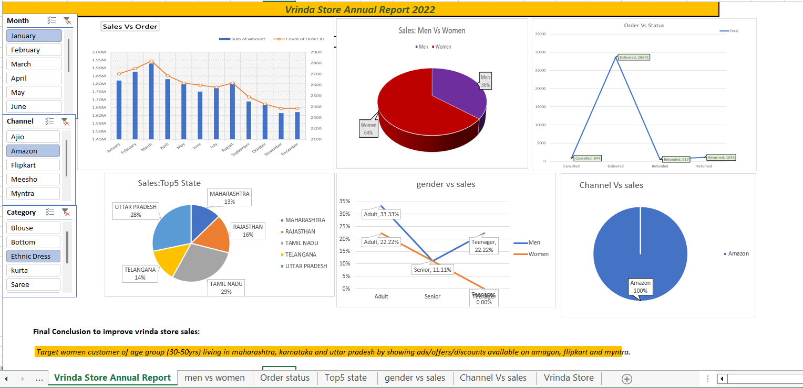

📊# Vrinda Store Sales Dashboard (Excel)

## Dashboard Preview

📊 Vrinda Store Sales Dashboard (Excel)

📌 Project Overview
This project presents an interactive sales dashboard for Vrinda Store using Microsoft Excel.
The dashboard analyzes 2022 sales performance and provides insights into customer behavior, sales channels, and regional performance.
The goal of this project is to demonstrate data analysis and visualization skills using Excel tools such as Pivot Tables, Charts, and Slicers.

🛠 Tools & Technologies Used
Microsoft Excel
Pivot Tables
Pivot Charts
Data Cleaning
Slicers for Interactive Filtering

📂 Dataset Information
The dataset contains sales records for Vrinda Store including:
Order ID
Customer ID
Gender
Age Group
Sales Amount
Order Status
State
Sales Channel
Product Category

📊 Dashboard Features
The dashboard includes the following visualizations:
Sales vs Orders (Monthly Trend) – compares total sales with number of orders across months.
Sales by Gender – distribution of sales between men and women customers.
Order Status Analysis – shows delivered, cancelled, refunded, and returned orders.
Top 5 States by Sales – identifies states generating the highest revenue.
Gender vs Age Group Sales – compares purchasing behavior by age group.
Channel vs Sales – identifies the most effective sales channels.

Interactive slicers allow filtering by:
Month
Channel
Category

📈 Key Insights : 
Women customers contribute ~64% of total sales.
Majority of orders are successfully delivered.
Top performing states include Tamil Nadu, Uttar Pradesh, Rajasthan, and Maharashtra.
Amazon is the dominant sales channel.
Adult customers generate the highest share of sales.

💡 Business Recommendation : 
Vrinda Store should focus marketing efforts on women customers aged 30–50 years in Maharashtra, Karnataka, and Uttar Pradesh.
Promotions and discounts on platforms such as Amazon, Flipkart, and Myntra can further increase sales.
